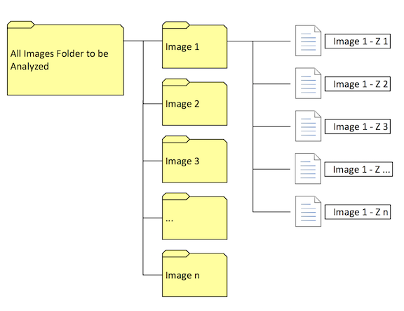

## ChromCond Instructions.
 
 ChromCond is Matlab code that quantiffies **chromatin compaction**. Following are instructins on how to download, install and use the tool.

## How to Download
In order to download [ChromCond](https://raw.githubusercontent.com/McCuskerLab/ChromCon/master/ChromCond.m) just click on the [link](https://raw.githubusercontent.com/McCuskerLab/ChromCon/master/ChromCond.m) and save the file locally to your computer as a **.m** (matlab) file. 

## How to install
As an installation, you just need to place the saved file somewere in your computer where you can find it. Preferably within your **MATLAB** folder.

## How to use
In order to use the **ChromCond** code, first open Matlab and oopen the **.m** file you saved above.
Before you run the code, make sure your images are split into individual ***.tif*** files corresponding to each of the optical sectinons of you image, saved into individual folders for each image to be anlyzed. 

All these folders should be inside a master folder as indicated in the following image.

Now you can just ***Run*** the code.

## How does it work? What does it do?
The first thing the code does is is ask you for the location of the master folder containing the image folders with the individual ***.tif*** files.
Afer you selec the master folder, Matlab will go to work. Depending on the ammount of images you are processing and the memory and speed of your computer, this process can take several minutes.
Once the process is complete, Matlab will generate an individual ***.csv*** file for each of the images in the mater folder. Each one of these includes the name of each slice analyzed, the nuvclear area in each slice, the condensation area for each slice and the ratio of these two (***the condensation index***) for each.
